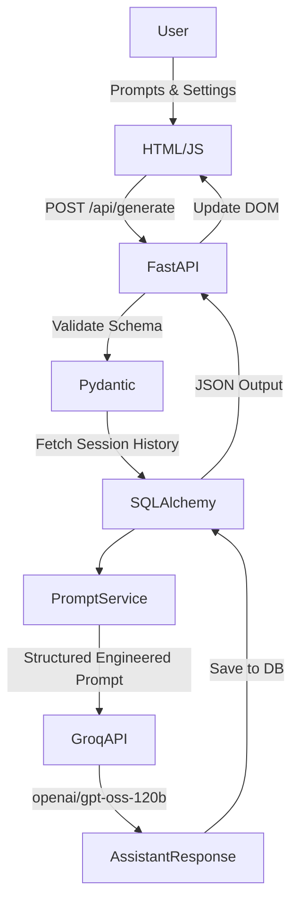

# AI Content Generation Chatbot Using LLM and Prompt Engineering

An AI-powered chatbot that uses Groq-hosted large language models and structured prompt engineering to generate emails, reports, technical explanations, and other content through a modern conversational interface.


---

## 3. PROJECT OVERVIEW

This project is a modern web-based AI assistant designed to generate structured, context-aware content. By bridging an intuitive chat interface with the lightning-fast Groq API, the application allows users to dictate parameters like tone, audience, and length. Behind the scenes, the FastAPI backend uses advanced Prompt Engineering to ensure the Large Language Model generates highly specific, well-formatted results. All conversational context is saved across multiple chat sessions using a local SQLite database, allowing users to return to past sessions seamlessly.

## 4. PROBLEM STATEMENT

Users often need to generate various forms of content (professional emails, academic reports, technical explanations, interview answers). Traditional manual writing requires significant time and effort, and generic AI chatbots often output unpredictable or unstructured responses unless meticulously prompted. This application solves this by providing a unified UI where users simply provide instructions and toggle generation parameters, offloading the heavy burden of prompt engineering to the backend.

## 5. OBJECTIVES

* Build a Generative AI chatbot.
* Integrate an LLM through Groq API.
* Apply prompt engineering techniques.
* Generate multiple types of content.
* Provide user-controlled tone, audience, and length.
* Maintain conversation history.
* Support multiple chat sessions.
* Allow users to continue previous conversations.
* Allow editing and regenerating previous prompts.
* Provide a deployable web application.

## 6. KEY FEATURES

### AI Generation
* Email generation
* Report generation
* Technical explanation
* General content generation

### Prompt Engineering
* Role, Task, Context, Audience, Tone, Length, Output format injection

### Generation Controls
* Generate
* Regenerate
* Improve
* Shorten
* Expand

### Chat
* New Chat
* Session-based conversations
* Chat history sidebar
* Continue previous conversations
* Current session persistence
* Edit previous prompts
* Save & Regenerate

### Utility
* Copy response
* Download response as TXT
* Loading state & Error handling
* Responsive UI with Markdown rendering (`marked.js`)

## 7. TECHNOLOGY STACK

| Layer           | Technology              |
| --------------- | ----------------------- |
| Frontend        | HTML5, CSS3, JavaScript |
| Backend         | Python, FastAPI         |
| AI/LLM          | Groq API                |
| Model           | `openai/gpt-oss-120b`   |
| Database        | SQLite                  |
| ORM             | SQLAlchemy              |
| Validation      | Pydantic                |
| Server          | Uvicorn                 |
| Testing         | Pytest                  |
| Deployment      | Render                  |
| Version Control | Git/GitHub              |

## 8. SYSTEM ARCHITECTURE



## 9. HOW THE APPLICATION WORKS

1. User opens the chatbot.
2. A chat session is created or restored from the sidebar.
3. User enters a prompt and selects content type, tone, audience, and desired length.
4. Frontend sends request to FastAPI.
5. Backend validates the request via Pydantic.
6. Backend fetches the last 4 messages of the session to provide context without exceeding token limits.
7. Prompt engineering service constructs a structured prompt based on the user's settings.
8. Groq API receives the request.
9. The `gpt-oss-120b` model generates the response.
10. The assistant response is stored in SQLite.
11. Frontend displays the generated response formatted as Markdown.
12. User can continue chatting, regenerate, improve, shorten, expand, copy, download, or edit their prompt.

## 10. PROMPT ENGINEERING

Prompt engineering is utilized to ensure consistent, high-quality output. Instead of passing the raw user input directly to the LLM, the backend constructs a highly detailed instruction set.

### Example Prompt Structure Built by the Backend:
```text
Role:
You are a professional editorial consultant.

Task:
Improve the clarity and impact of the provided text.

Audience:
General Audience.

Tone:
Professional.

Length:
Medium.

Draft Content to Improve:
"I want to ask for an internship."

Requirements:
Ensure the tone matches the requested settings and format the output cleanly.
```
This structured approach guarantees better control over generated output.

## 11. CONTENT TYPES

### Email
Generates professional and structured emails suitable for corporate environments.
### Report
Generates structured academic or professional reports with proper headings.
### Technical Explanation
Explains technical concepts adjusted to the cognitive level of the selected audience (e.g. analogies for Beginners, architectural details for Experts).
### General Content
Generates general-purpose content based on user instructions.

## 12. CHAT SESSION SYSTEM

The application groups messages into unique sessions to organize conversational memory.

```text
Session 1 (Title: "Explain Python Basics")
 ├── User message
 ├── Assistant response
 ├── User message
 └── Assistant response

Session 2 (Title: "Write HR Email")
 ├── User message
 └── Assistant response
```

Features include:
* **New Chat:** Clears the context and starts a fresh database session.
* **Open previous chat:** Instantly loads historical messages from SQLite.
* **Delete chat:** Completely purges a session from the database.

## 13. EDIT & REGENERATE

Users can click "Edit" under their previous prompt to modify their request. 
Upon clicking "Save & Regenerate", the application:
1. Truncates all subsequent messages in the UI.
2. Sends a `PUT` request to `/api/sessions/{session_id}/edit_prompt`.
3. The backend deletes downstream conversational history in the database.
4. Generates a fresh response seamlessly, continuing the session from the new branch.

## 14. PROMPT TEMPLATES

The application includes predefined dropdown settings (Content Type, Tone, Audience, Length). Selecting different combinations seamlessly modifies the underlying prompt template injected by `PromptService`.

## 15. DATABASE DESIGN

The SQLite database is managed via SQLAlchemy ORM.

### ChatSession
* `id` (String / UUID)
* `title` (String)
* `created_at` (DateTime)
* `updated_at` (DateTime)

### ChatMessage
* `id` (Integer)
* `session_id` (String)
* `role` (String)
* `content` (String)
* `content_type` (String)
* `tone` (String)
* `audience` (String)
* `length` (String)
* `created_at` (DateTime)

**Relationship:** One `ChatSession` -> Many `ChatMessages`.

## 16. API ENDPOINTS

| Method | Endpoint                     | Description               |
| ------ | ---------------------------- | ------------------------- |
| GET    | `/`                          | Web application           |
| GET    | `/api/health`                | Health check              |
| POST   | `/api/generate`              | Generate content          |
| POST   | `/api/regenerate`            | Regenerate response       |
| POST   | `/api/improve`               | Improve response          |
| POST   | `/api/shorten`               | Shorten response          |
| POST   | `/api/expand`                | Expand response           |
| GET    | `/api/sessions`              | List sessions             |
| GET    | `/api/sessions/{session_id}` | Get session               |
| DELETE | `/api/sessions/{session_id}` | Delete session            |
| PUT    | `/api/sessions/{session_id}/edit_prompt` | Edit & Regenerate |
| GET    | `/api/groq-status`           | Groq configuration/status |

## 17. PROJECT STRUCTURE

```text
AI_Content_Generation_Chatbot/
│
├── app/
│   ├── main.py
│   ├── database.py
│   ├── models.py
│   ├── schemas.py
│   │
│   ├── routes/
│   │   ├── chat.py
│   │   ├── history.py
│   │   └── health.py
│   │
│   ├── services/
│   │   ├── ai_provider.py
│   │   ├── groq_service.py
│   │   └── prompt_service.py
│   │
│   └── prompts/
│       └── (System Prompt Templates)
│
├── static/
│   ├── css/
│   │   └── style.css
│   └── js/
│       └── app.js
│
├── templates/
│   └── index.html
│
├── tests/
│   └── (Pytest files)
│
├── .env.example
├── .gitignore
├── requirements.txt
├── render.yaml
└── README.md
```

## 18. INSTALLATION

```bash
git clone https://github.com/pushpakgaidhane294/AI_Content_Generation_Chatbot.git
cd AI_Content_Generation_Chatbot
python -m venv .venv
.venv\Scripts\activate
pip install -r requirements.txt
```

## 19. ENVIRONMENT VARIABLES

Create a `.env` file (never commit this to GitHub) and add:

```env
AI_PROVIDER=Groq
GROQ_API_KEY=your_groq_api_key_here
GROQ_MODEL=openai/gpt-oss-120b
DATABASE_URL=sqlite:///./chatbot.db
```

## 20. GETTING A GROQ API KEY

To run this application, you must obtain a free API key from the [Groq Console](https://console.groq.com/).

## 21. RUN LOCALLY

```bash
uvicorn app.main:app --reload
```
Open your browser to `http://127.0.0.1:8000`.

## 22. API DOCUMENTATION

FastAPI automatically generates interactive OpenAPI documentation. Once the server is running, visit:
* `/docs` for Swagger UI
* `/redoc` for ReDoc UI

## 23. TESTING

Run the comprehensive test suite using:
```bash
pytest
```
Tests cover prompt engineering generation, health endpoints, model initialization, and data schemas.

## 24. RENDER DEPLOYMENT

This project is configured for seamless deployment to [Render](https://render.com).

### Build Command
```bash
pip install -r requirements.txt
```

### Start Command
```bash
uvicorn app.main:app --host 0.0.0.0 --port $PORT
```

Ensure `GROQ_API_KEY` and `GROQ_MODEL` are set directly in Render's Environment Variables dashboard. The included `render.yaml` automatically orchestrates the web service configuration.

## 25. SECURITY

* API keys are securely stored in environment variables and are never exposed to frontend JavaScript.
* `.env` is listed in `.gitignore` to prevent accidental commits.
* Server-side Groq requests ensure strict prompt boundaries.
* Input validation is strictly enforced via FastAPI and Pydantic schemas.

## 26. ERROR HANDLING

* **Network/API Errors:** Caught by the Groq Service layer and translated into user-friendly HTTP 500/503 errors.
* **Token Limits (HTTP 413):** The backend truncates session history arrays to prevent exceeding Groq TPM limits.
* **Validation Errors (HTTP 422):** Pydantic immediately rejects invalid content types or empty prompts before contacting the LLM.

## 27. UI FEATURES

* Session History Sidebar
* Modern Chat Bubbles (User / AI separation)
* Dropdown Controls (Tone, Audience, Length)
* Action Buttons (Regenerate, Improve, Shorten, Expand, Copy, Download)
* Inline Prompt Editing
* Markdown Rendering

## 28. USE CASES

* Writing professional emails
* Academic report drafting
* Learning technical concepts
* Resume content creation
* Interview preparation
* Social media content
* General writing assistance

## 29. EXAMPLE

### Input
```text
Explain REST API to a beginner.
```
**Settings:** `Technical Explanation`, `Simple`, `Beginner`, `Medium`.

The system intercepts this, retrieves previous conversational memory, constructs a strict instructional prompt dictating a "Beginner-friendly analogy", and seamlessly pipes the result from Groq to the screen.

## 30. ADVANTAGES

* Centralized AI content generation
* Customizable output via prompt engineering
* Persistent conversational workflow
* Reusable chat sessions
* Easy web interface
* Production-ready deployment architecture

## 31. LIMITATIONS

* Generated content may require human verification.
* Groq API availability depends on external service uptime and token limits.
* SQLite is suitable for this academic scale but would require migration to PostgreSQL for massive multi-user scaling.

## 32. FUTURE ENHANCEMENTS

* User authentication
* PostgreSQL database transition
* Streaming response typing effect
* Document upload / summarization
* Export to PDF/DOCX

## 33. ACADEMIC RELEVANCE

This project serves as a comprehensive demonstration of:
* Generative AI & Large Language Models
* Prompt Engineering & Context Management
* REST API Integration (FastAPI)
* Relational Database Management (SQLite/SQLAlchemy)
* Frontend Development (HTML/CSS/JS)
* Software Testing (Pytest)
* Cloud Deployment (Render)

## 34. LEARNING OUTCOMES

* Understanding LLM-based content generation
* Designing structured prompts
* Integrating external AI APIs
* Building FastAPI services
* Managing conversational data
* Deploying an AI application

## 35. PROJECT STATUS

Status: Completed / Working

## 36. AUTHOR

**Pushpak Gaidhane**

B.Tech – Artificial Intelligence and Data Science  
YCCE, Nagpur

[GitHub Profile](https://github.com/pushpakgaidhane294) | [LinkedIn Profile](https://www.linkedin.com/in/pushpak-gaidhane/)

## 37. LICENSE

This project was developed for academic and educational purposes.
